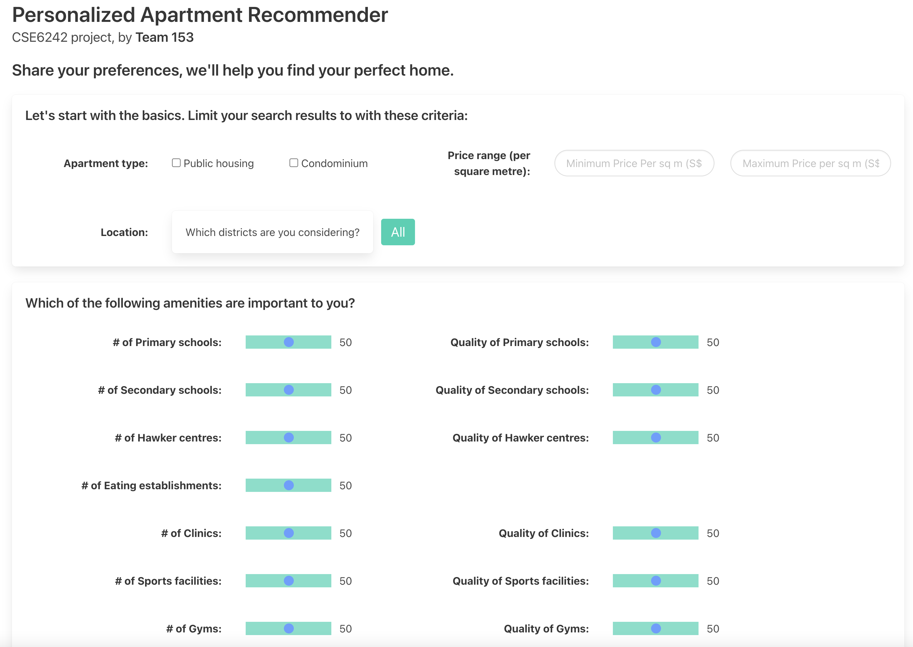
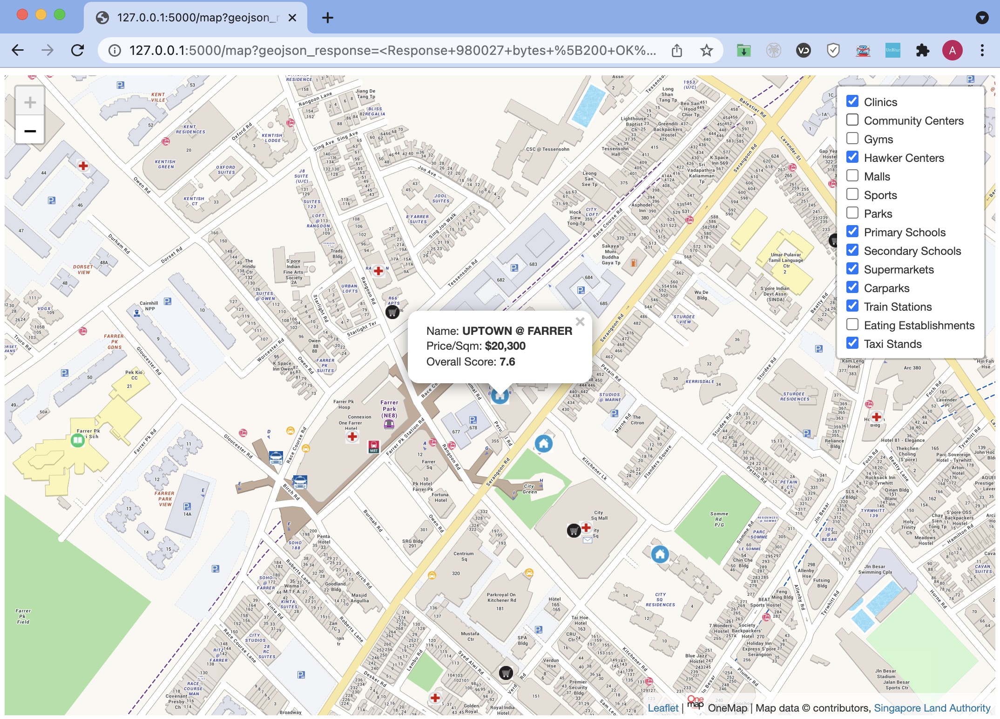

# Personalized Apartment Recommendations Project

https://github.com/ansellim/apartments.git

Group members: Ansel Lim, Daosheng Lin, Hong Wen (Key) Tai, Keith Loo

Author of this readme: Ansel Lim.

## Introduction

The purpose of our web application is to help homebuyers in Singapore find their ideal homes based on their preferences.
In particular, we feel that while homebuyers can easily access price information online, it is not so easy for
homebuyers to select neighborhoods or property projects based on the amenities and facilities (e.g., parks, malls, or
schools) which are available in the vicinity. Furthermore, different homebuyers may have different preferences with
regard to types of amenities and facilities. Therefore, the novelty of our project lies in how a homebuyer may define
his preferences, and our application returns *personalized* recommendations based on a scoring system which uses the
preference weight assignments defined by the user.

## What data was analyzed

A total of **10,614** properties were analyzed. Transaction records were obtained from the Housing and Development
Board (
HDB) and the Urban Redevelopment Authority (URA). The HDB dataset contained sale prices, floor areas, and block and
street names for public housing apartments which were sold in the market from 2017 to 2021. The URA dataset contained
sale prices, floor areas, project names, and street names for private residential properties sold from 2017 to 2021.

A total of **32,695** amenities were analyzed. We obtained datasets containing the addresses and/or locations of
amenities (which we also call "features") in the city. The following table shows the fourteen different types of
amenities for which we had location information. For some of these amenity types, we computed **weighted quality
scores** based on the ratings (0 to 5 stars) these amenities received on Google Places. These scores were *weighted*
scores in the sense that the ratings were adjusted for the number of ratings an amenity receives in comparison to the
total number of ratings received by amenities of the same type.

| Type of place                                              | Standardized `feature_type` variable name | Quality scores available?  |
|------------------------------------------------------------|------------------------------------------|----------------------------|
| CHAS clinic                                                | `clinic`                                 | Yes                        |
| Community center                                           | `community_center`                       | Yes                        |
| Gym                                                        | `gym`                                    | Yes                        |
| Hawker center                                              | `hawker_center`                          | Yes                        |
| Shopping mall                                              | `mall`                                   | Yes                        |
| Other public sports facilities (mostly swimming complexes) | `other_public_sports_facility`           | Yes                        |
| Park                                                       | `park`                                   | Yes                        |
| Primary school                                             | `primary_school`                         | Yes                        |
| Secondary school                                           | `secondary_school`                       | Yes                        |
| Supermarket                                                | `supermarket`                            | Yes                        |
| Bus stop                                                   | `bus_stop`                               | No                         |
| Carpark                                                    | `carpark`                                | No                         |
| Subway (MRT) station                                       | `mrt`                                    | No                         |
| F&B (eating establishment)                                 | `eating_establishment`                   | No (too many to calculate) |
| Taxi stand                                                 | `taxi_stand`                             | No                         |

## Creating our custom database

With location data available for homes as well as amenities, we then computed, for each residential property project,
the **number of amenities** ("quantity score") as well as the **median weighted quality score of amenities** ("quality
score") in the residential property's vicinity. The definition of vicinity used was one-kilometer radius. To illustrate,
the residential property project "City Gate" at Beach Road has 10 gyms within a one-kilometer radius, and the median
weighted quality score of these 10 gyms is 3.59.

The quantity scores are then binned into discrete categories based on our visual inspection of their individual
distributions. The quality scores are scaled with min-max scaling. For fairness, all scores are standardized to fall
within the `[0,1]` interval.

The data pertaining to quantity and quality scores of each property are stored in the `properties` table `database.db`,
a SQLite database. For each property, we also store location and price data. In a different table `features` in the same
database, we also store information pertaining to the amenities.

Here is a table showing the schema of the `properties` table.

| Attribute                                                    | Description                                                                                                                                                      |
|--------------------------------------------------------------|------------------------------------------------------------------------------------------------------------------------------------------------------------------|
| `project_id`                                                 | A unique identifier for each property                                                                                                                            |
| `project`                                                    | Name of property 'project': condominium name or HDB block                                                                                                        |
| `project_type`                                               | Project type: HDB or condominium                                                                                                                                 |
| `lat`                                                        | Latitude                                                                                                                                                         |
| `long`                                                       | Longitude                                                                                                                                                        |
| `price_per_sqm`                                              | Average price per square meter of units in this property (historical)                                                                                            |
| `district`                                                   | Postal district                                                                                                                                                  |
| `num_` + any `feature_type` in the list of feature types     | (binned) quantity score: binned and scaled number of features of that `feature_type` within 1km of the property                                                  |
| `raw_num_` + any `feature_type` in the list of feature types | raw, unscaled quantity score: number of features of that `feature_type` within 1km of the property                                                               |
| `quality_` + any `feature_type`                              | (scaled) quality score: scaled median quality score (weighted/normalized Google Places API rating) of features of that `feature_type` within 1km of the property |
| `raw_quality_` + any `feature_type`                          | unscaled quality score: median quality score (weighted/normalized Google Places API rating) of features of that `feature_type` within 1km of the property        |
| `feature_ids_` + any `feature_type`                          | a list of `feature_id`'s of that `feature_type` within 1km of the property; can join with `features.csv` to get feature data attributes                          |
| `condo_street`                                               | Street name (only available for condominiums)                                                                                                                    |
| `condo_market_segment`                                       | Market segment (only available for condos)                                                                                                                       |
| `condo_commonest_tenure`                                     | Commonest tenure type (only available for condominiums)                                                                                                          |
| `hdb_avg_floor_area_sqm`                                     | Average floor area of transacted units in the property (available for HDB only)                                                                                  |
| `hdb_avg_resale_price`                                       | Average resale price of units in the property (available for HDB only)                                                                                           | 

Here is a table showing the information available in the `features` table.

| Attribute| Description                                                                                                                                                                                         |
| ------ |-----------------------------------------------------------------------------------------------------------------------------------------------------------------------------------------------------|
| `feature_id` | A unique identiifer for each feature                                                                                                                                                                |
| `name` | Name of feature                                                                                                                                                                                     |
| `google_place_id` | A unique place ID assigned to a place                                                                                                                                                               |
| `num_ratings` | Number of ratings on Google Places API                                                                                                                                                              |
| `avg_rating` | Average rating on Google Places API (max of 5 stars)                                                                                                                                                |
| `weighted_rating` | A weighted rating, calculated according to formula in report                                                                                                                                        |
| `W` | a "normalization" ratio used in calculation of weighted rating. Equals the number of ratings for a feature divided by the maximum number of ratings across all features with the same feature type. |
| `lat` | Latitude                                                                                                                                                                                            |
| `long` | Longitude                                                                                                                                                                                           |
| `address` | Address of the feature, if available                                                                                                                                                                |
| `feature_type` | Type of feature (type of place of interest)                                                                                                                                                         |

## How the application works

Our web application is simple and intuitive. The user specifies the parameters of his search by specifying a price
range. Since different properties have different floor areas, price per square meter is a simple way to compare home
prices across projects. The user may also restrict the search to a selection of districts in the city. Then, the user
specifies the priority and importance of various amenities.



Based on the user's settings, an SQL query is then executed. The user's weights are applied to the precomputed scores
available for each property. A weighted score for each property is thereby calculated. The SQL query then returns a
shortlist of properties which are then passed as a GeoJSON object to our map, which is based on OneMap Singapore's
API (https://www.onemap.gov.sg/docs/), which is a mapping application designed for Singapore.

The user may then view the top recommendations (top 5 recommendations) as well as nearby amenities in the browser.



## Try it out yourself! (How to Install and Demo the App)

### Run the app locally (recommended)

1. Clone this repository.

2. Then, create a conda environment using the `environment.yml` file by running the following command in the project
   root.

    ```
    conda env create -f environment.yml
    ```

3. Then, activate the new environment with `conda activate apartments-project`.

4. Then, run the app by entering `flask run` in your terminal window, and then go to http://127.0.0.1:5000/ in your
   favorite browser.

### How to run the app on the web

The deployment [https://apartments-recommendation.herokuapp.com/](https://apartments-recommendation.herokuapp.com/) is
buggy and doesn't work, so I recommend trying the app out on your local machine by following the instructions above.

## Examples

### Example 1: Persona 1 of ....

Examples of queries go here.

### Example 2